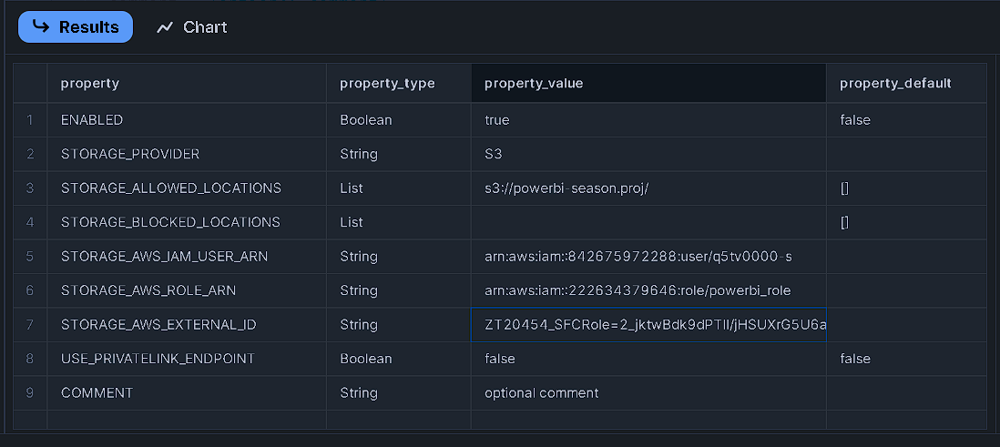
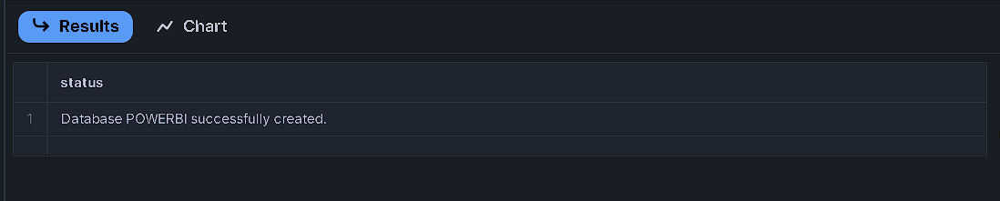
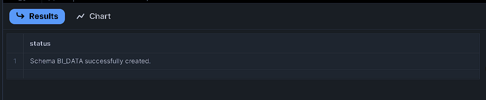
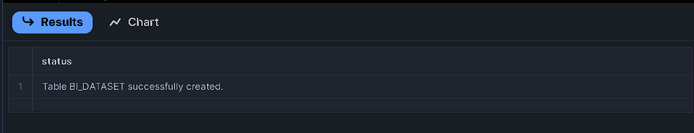
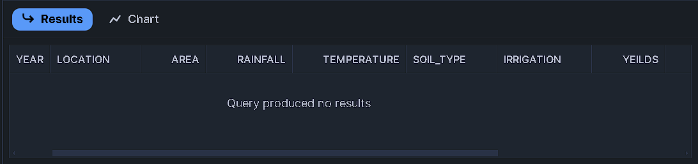
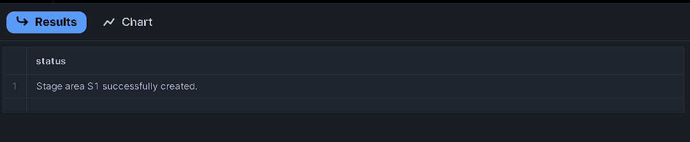
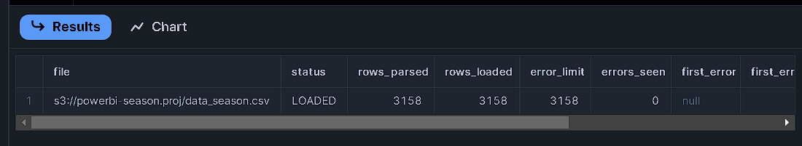
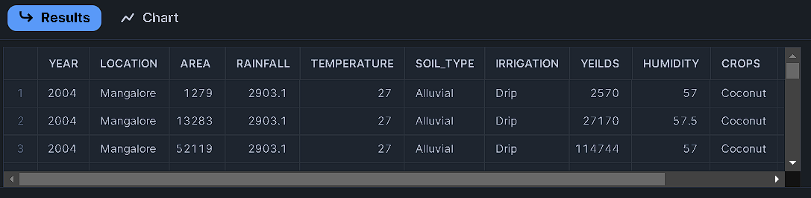

# Snowflake-PowerBI-Project

*This repository contains SQL scripts for integrating Snowflake with AWS S3 for Power BI analysis.*

**Season-storage_integration**

create or replace storage integration integration_PBI

type = external_stage

storage_provider = \'S3\'

enabled = true

storage_aws_role_arn = \'arn:aws:iam::222634379646:role/powerbi_role\'

storage_allowed_locations = (\'s3://powerbi-season.proj/\')

comment = \'optional comment\'

**To describe the integration object:**

//description integration obj

desc integration integration_PBI;

<b><i>Result:</i></b>

***Season-CREATE DB, Schema, Table & Stage**

***Create a database:***

CREATE database PowerBI;

<b><i>Result:</i></b>

***Create a schema:***

create schema BI_Data;

<b><i>Result:</i></b>

***Create a Table:***
create table BI_Dataset (

Year int, Location string, Area int,

Rainfall float, Temperature float, Soil_type string,

Irrigation string, yeilds int,Humidity float,

Crops string,price int,Season string

);

<b><i>Result:</i></b>

***To check the dataset:***

select \* from BI_Dataset;

<b><i>Result:</i></b>

***Create a stage:***

create stage BI_Data.s1

url = \'s3://powerbi-season.proj\'

storage_integration = integration_PBI

<b><i>Result:</i></b>

***To load data from the stage into the dataset:***
copy Into BI_Dataset

from \@s1

file_format = (type=csv field_delimiter=\',\' skip_header=1 )

on_error = \'continue\'

<b><i>Result:</i></b>

***To verify the data:***
select \* from BI_Dataset;

<b><i>Result:</i></b>

